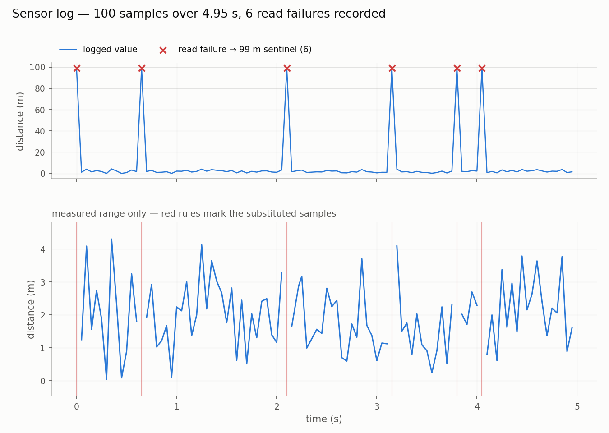

# python-sensor-logger

A fixed-rate data-acquisition loop that timestamps every sample, survives intermittent
sensor failures without corrupting the record, and writes a CSV and a plot of the run.

<p align="center">
  <picture>
    <source media="(prefers-color-scheme: dark)" srcset="results/sensor_log_dark.png">
    
  </picture>
</p>

The chart above is a real run, not an illustration — it is the exact `results/sensor_log.png`
produced by `main.py` from the committed `results/sensor_log.csv`. The top panel is the record
as written: the six spikes to 99 m are sensor read failures the logger caught, timestamped and
recorded rather than crashed on. The bottom panel drops to the measured range, where those same
failures appear as gaps, because on the full scale a 99 m sentinel compresses every real reading
into an unreadable band at the bottom of the axis.

## What it does

Calls a sensor at a target rate for a fixed duration, stamping each reading with elapsed
time since the start of the run. Reads that raise, return `None`, or return a non-finite
value are replaced with a sentinel and logged as warnings; readings outside the plausible
range are clamped. The result is written to CSV and plotted, with substituted samples
marked so a bad sample can never be mistaken for a measurement.

No hardware required — `sensor.py` simulates a rangefinder with Gaussian noise and a 5%
failure rate, so the whole pipeline runs anywhere.

## Measured performance

From the committed run in `results/` — 5.0 s target duration, 20 Hz target rate, 2.0 m
simulated target:

| Metric | Result |
| --- | --- |
| Samples recorded | 100 over a 4.95 s span |
| Mean sample rate | 20.00 Hz (mean and median interval both 50.0 ms) |
| Interval accuracy | 97 of 99 intervals landed at exactly 50 ms |
| Worst-case timing | one 69 ms interval at t = 2.15 s, immediately followed by a 31 ms interval |
| Net drift from that hiccup | 0 ms — the two intervals sum to exactly 100 ms |
| Sensor read failures | 6 of 100 samples (6.0% observed, against a 5.0% injected rate) |
| Failures that lost a sample | 0 — every failure produced a timestamped sentinel row |
| Range clamps applied | 0 |
| Valid readings | 94, mean 1.945 m and σ 1.015 m against a 2.0 m target with σ 1.0 configured |

The timing row is the one worth reading twice. A single OS scheduling hiccup made the loop
oversleep by 19 ms; the next sleep came back 19 ms short and the run returned to its
original schedule with no accumulated error. That is the deadline design doing its job — a
loop that slept a flat 50 ms each iteration would have kept those 19 ms permanently, and
every subsequent timestamp would have been wrong by at least that much.

## Design decision: a sentinel outside the valid range

When a read fails, `reader.py` substitutes `DEFAULT = 99.0` m — a value deliberately placed
outside the `[LO, HI] = [0, 10]` m clamp range, and deliberately *not* passed through the
clamp that constrains real readings.

The alternatives are worse in a way that matters for unattended acquisition. Dropping the
sample silently shortens the record and breaks the assumption that row *n* is 50 ms after
row *n−1*. Carrying the last good value forward makes a dead sensor look like a stationary
target — the failure mode that is hardest to notice and most expensive to discover later.
Writing `NaN` is defensible, but it propagates through arithmetic and gets silently dropped
by many downstream tools.

A sentinel that cannot occur naturally means every substituted sample is recoverable from
the CSV alone with `distance == 99.0`, which is exactly what `plotting.py` does to draw the
markers in both panels. The record stays complete and self-describing: nothing is lost, and
nothing that was invented can be mistaken for something that was measured.

## Bug found and fixed: the loop that never returned

The first version of `run()` in `logger.py` looked like this:

```python
def run(duration, hz):
    dt = 1.0 / hz
    next_t = time.perf_counter()

    while True:
        next_t += dt
        sleep = next_t - time.perf_counter()
        if sleep > 0:
            time.sleep(sleep)
```

It took a `duration` argument and never used it. The loop paced itself correctly at 20 Hz
and ran forever, and because nothing was accumulated or returned, it produced no data even
while running — it was a timer that looked like a logger.

The fix anchors a start time `t0`, bounds the loop on elapsed time against `duration`,
accumulates `(timestamp, reading)` tuples in `rows`, and returns them
(commit `512ed0a`, "Fixed logger, added main wiring"):

```python
t0 = next_t = time.perf_counter()
rows = []

while time.perf_counter() - t0 < duration:
    rows.append((round(time.perf_counter() - t0, 3), read()))
    next_t += dt
    ...

return rows
```

Keeping `next_t` separate from `t0` is what preserves the deadline behaviour: `t0` answers
"when do I stop", `next_t` answers "when is the next sample due", and conflating them would
have reintroduced the drift that the 69/31 ms recovery above shows the loop absorbing.

## Repository layout

```
sensor.py          simulated rangefinder: Gaussian noise, 5% read failures
reader.py          wraps a read function with error handling, validation and clamping
logger.py          fixed-rate acquisition loop, returns (time, value) rows
recorder.py        CSV write and read-back
plotting.py        two-panel time series with substituted samples marked
config.py          run parameters: rate, duration, valid range, sentinel
main.py            wires the modules together and runs one acquisition
results/           committed CSV and light/dark PNGs from the run described above
requirements.txt
```

## Running it

```bash
pip install -r requirements.txt
python main.py
```

Regenerates `results/sensor_log.csv` plus a light and a dark rendering of the plot
(`sensor_log.png` and `sensor_log_dark.png`), and logs a warning line for each substituted
sample. Run parameters live in `config.py`; the two chart themes are defined in
`plotting.THEMES`.

## Requirements

- Python 3.8+
- matplotlib — used by `plotting.py`
